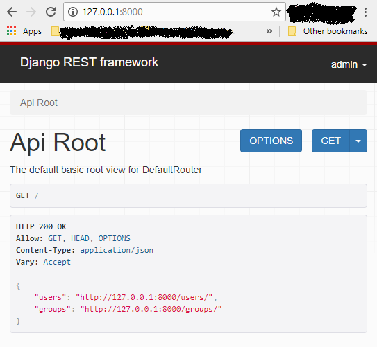

# Django REST framework Quickstart from http://www.django-rest-framework.org/tutorial/quickstart/

First, be sure to donwload and install Python from https://www.python.org/downloads/

Also, be sure to install VirtualEnv.

```
pip install virtualenv
```

You can refer to this article on how to install Python and VirtualEnv and others: http://timmyreilly.azurewebsites.net/python-pip-virtualenv-installation-on-windows/

Here is a screenshot of the result after I completed the tutorial:

